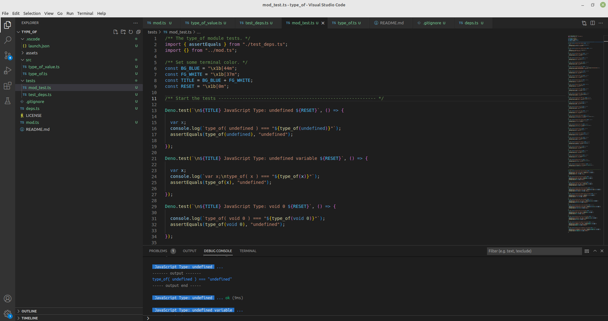

# type_of
> An importable TypeScript method to fix the JavaScript **typeof** operator. This code is written as a module for the **deno** runtime. If you would like to visit the deno.land module page for **type_of()** [type_of deno module](https://deno.land/x/type_of).

## Table of Contents
* [General Info](#general-info)
* [Features](#features)
* [Tech](#tech)
* [Screenshots](#screenshots)
* [Setup](#setup)
* [Usage](#usage)
* [Examples](#examples)
* [Versions](#versions)
* [Acknowledgements](#acknowledgements)
* [Contact](#contact)
* [License](#license)


## General Info
While programming many years with _JavaScript_, I've ran into many bugs using the **typeof** operator to check data types. 
The bugs have carried over to using _TypeScript_ as well. I decided to research all the bugs and build an alternative typeof as a method named **type_of ()**. This module is created to work on the deno runtime.


## Features
Below are the current features of the **type_of ()** module.
- Proper **undefined** check
- Proper **null** check
- Can type check all common **JavaScript primitive types**.
- Can type check **complex types** like **object** and seperate it into **exact types**.
- Can type check all methods including **anonymous** arrow functions.
- Can type check **arrays**.
- Using **extended** option can return **class names**.
- Can type check new JavaScript types like **bigint** and **symbol**.
- Can type check internal JavaScript functions like **eval**, **JSON**, **NaN**, etc.
- JavaScript **Errors** can return **proper type** and **name**.
- In extended mode can seperate numbers into number types, integer, float, nan, infinity, bigint.
- In extended mode can seperate strings into **'string'** for literal, and **'string Object'** for **new String('foo')**; 

## Tech
- **Deno** - version 1.25.0
- **TypeScript** - version 4.7.4
- **V8** - version 10.4.132.20
- **Visual Studio Code** - 1.70+


## Screenshots



## Setup
Things you will need to get this module running. You will need to install **Deno** runtime for _Javascript / TypeScript_.

- [Deno Installation](https://deno.land/manual@v1.25.0/getting_started/installation)
- [Visual Studio Code Installation](https://code.visualstudio.com/Docs/setup/setup-overview)
- [Deno Plugin Install for VSC](https://deno.land/manual@v1.25.0/vscode_deno)


### Installing code from github
```bash
    # git clone git@github.com:Codevendor/type_of.git
```

### Installing code from deno.land with import statement. [type_of deno module](https://deno.land/x/type_of)
```js
    // Snake case version - type_of();
   import { type_of } from "https://deno.land/x/type_of@v2.1.0/mod.ts";
   
   // Or
   
   // Camel case alias - typeOf()
   import { typeOf } from "https://deno.land/x/type_of@v2.1.0/mod.ts";
```


## Usage
The method **type_of ()** was built to mimic the JavaScript **typeof** operator. The purpose is to keep the familiarity of the functionality while correcting the known bugs with the operator code. I have also extended the method with a second optional boolean parameter for returning names of functions, classes, errors, etc.

### Method - **type_of** ( **src**: _unknown_, **extended**: _boolean = false_ )
Listed below are the method **signature(s)**.

| Method Signature                        |
| :---------------------------------------- |
| **type_of** ( **src:** _unknown_ )  |
| **type_of** ( **src:** _unknown_, **extended:** _boolean = false_ )  |
| _alias_ **typeOf** ( **src:** _unknown_ ) |
| _alias_ **typeOf** ( **src:** _unknown_, **extended:** _boolean = false_ ) |

Listed below are the **parameter(s)** for the method.

| Param Name        | Type          | Description                                                                        |
| :----------------- | :------------- | :------------------------------------------------------------------------------ |
| **src**           | _unknown_         | The source to test for type.                                             |
| **extended**      | _boolean_       | Extends the return type string to include name. i.e _'function foo'_. Defaults to _false_.                 |

Below is the **return type** for the method.

| Return Type      | Description                                                                                       |
| :----------------- | :------------------------------------------------------------------------------------------------- |
| **string**        | A _string_ representing the correct type of the src. If ( _extended = true_ ) then string will return with name. i.e _'function foo'_                              |


### Javascript Primitive Types:
- **null**
- **undefined**
- **boolean**
- **number**
- **string**
- **symbol** --- (Available from **ES2015**)
- **bigint** --- (Available from **ES2020**)
- **array** --- (Added with **type_of()** module)

### Javascript Complex Type:
- **object**

### Extended types in type_of() module with ( _extended = true_ )
- **anonymous functions** --- ('function anonymous')
- **function names** --- ('function foo')
- **class names** --- ('function classname')
- **internal javascript function names** --- ('function eval')
- **error names** --- ('error RangeError', 'function RangeError')
- **number names** --- ('number integer', 'number float', 'number nan', 'number infinity', 'number bigint')
- **string literal vs string Object** --- ('string') for literal, ('string Object') for new String('foo')

## Examples
Examples will be shown below, but can also be found as assertion tests in the [mod_test.ts](./tests/mod_test.ts) file.

#### Type: unknown
While **type_of()** cant check for _unknown types_ that spit out **ReferenceErrors**, you can always be safe by starting your check like so. 
```js
window.foo && type_of(foo);
```

#### Type Response List
Below is a string response list for using the **type_of()** method. 

| Example | Response |
| :------ | :------- |
| **type_of** ( _unknown_ ) | "unknown" |
| **type_of** ( _undefined_ ) | "undefined" |
| **type_of** ( _void 0_ )    | "undefined" |
| **type_of** ( _null_ )      | "null"      |
| **type_of** ( _true_ )      | "boolean"   |
| **type_of** ( _12345_ )     | "number"    |
| **type_of** ( _"foo"_ )     | "string"    |
| **type_of** ( _Symbol()_ )      | "symbol"   |
| **type_of** ( _BigInt('9007199254740995')_ )      | "bigint"   |
| **type_of** ( _[]_ )      | "array"   |
| **type_of** ( _{}_ )      | "object"   |
| **type_of** ( _JSON_ )      | "json"   |
| **type_of** ( _Math_ )      | "math"   |
| **type_of** ( _/a-z/_ )      | "regexp"   |
| **type_of** ( _function foo() { }_ )      | "function"   |
| **type_of** ( _() => { }_ )      | "function"   |
| **type_of** ( _class foo { }_ )      | "function"   |
| **type_of** ( _NaN_ )      | "number"   |
| **type_of** ( _Infinity_ )      | "number"   |
| **type_of** ( _window_ )      | "window"   |
| **type_of**( _globalThis_ )      | "window"   |
| **type_of** ( _eval_ )      | "function"   |
| **type_of** ( _Date_ )      | "function"   |
| **type_of** ( _Error_ )      | "function"   |
| **type_of** ( _new Error()_ )      | "error"   |
| **type_of** ( _new RangeError()_ )      | "error"   |

#### Type Response List with ( _extended = true_ )
Below is an extended response list for **type_of** (src, true) 

| Example | Response |
| :------ | :------- |
| **type_of** ( _"foo", true_ ) | "string" |
| **type_of** ( _{}, true_ ) | "object Object" |
| **type_of** ( _Date, true_ ) | "function Date" |
| **type_of** ( _eval, true_ ) | "function eval" |
| **type_of** ( _function foo(){}, true_ ) | "function foo" |
| **type_of** ( _() => {}, true_ ) | "function anonymous" |
| **type_of** ( _class foo {}, true_ ) | "function foo" |
| **type_of** ( _new class foo {}, true_ ) | "object foo" |
| **type_of** ( _Error, true_ ) | "function Error" |
| **type_of** ( _new Error(), true_ ) | "error Error" |
| **type_of** ( _RangeError, true_ ) | "function RangeError" |
| **type_of** ( _new RangeError(), true_ ) | "error RangeError" |
| **type_of** ( _0, true_ ) | "number" |
| **type_of** ( _12345, true_ ) | "number integer" |
| **type_of** ( _-12345, true_ ) | "number integer" |
| **type_of** ( _12345.67, true_ ) | "number float" |
| **type_of** ( _-12345.67, true_ ) | "number float" |
| **type_of** ( _12345.67, true_ ) | "number float" |
| **type_of** ( _NaN, true_ ) | "number nan" |
| **type_of** ( _Infinity, true_ ) | "number infinity" |
| **type_of** ( _BigInt('9007199254740995'), true_ ) | "number bigint" |
| **type_of** ( _1.0, true_ ) | "number integer" <-- Internal js error |
| **type_of** ( _new String('foo'), true_ ) | "string Object" |

#### Unsolved Number Types
There is an internal issue with _JavaScript_ where **floats** starting or ending with zero get truncated off. So _1.0_ reports as _1_ and _1.01_ reports as _1.01_. I would love to fix this issue, but it's internal _JavaScript_. Only way to keep this precision is by keeping everything string.

```js
type_of( 1.0, true ) === 'number integer'        // <--- This is an error, because it should be a float.

// Should return this:
type_of ( 1.0, true ) === 'number float'        
```

## Versions
- **v2.1.0** --- Added new features for number and string.
1. Added in extended support for number. Now **type_of ()** can return (_'number integer'_, _'number float'_, _'number nan'_, _'number infinity'_, _'number bigint'_)
2. Added in extended support for _string literal_ vs _string Object_. Now **type_of ()** can return (_'string'_, _'string Object'_)
- **v2.0.0** --- Importable Method **type_of ()** or _alias_ **typeOf ()** with only one return type of (**string**) 
- **v1.0.0** --- Global method **type_of ()** with extended return type of (**string | type_of_value**)

## Acknowledgements
- This project was based on [this tutorial](https://javascriptweblog.wordpress.com/2011/08/08/fixing-the-javascript-typeof-operator/).
- Thanks to [Angus croll](https://github.com/angus-c)

## Contact
Created by _Adam Smith_ [@Codevendor](https://codevendor.com/) - feel free to contact me!


## License
This project is open source and available under the [... MIT License](./LICENSE).
